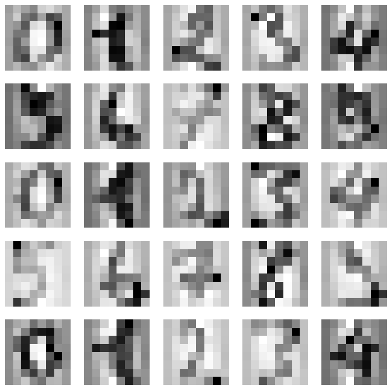
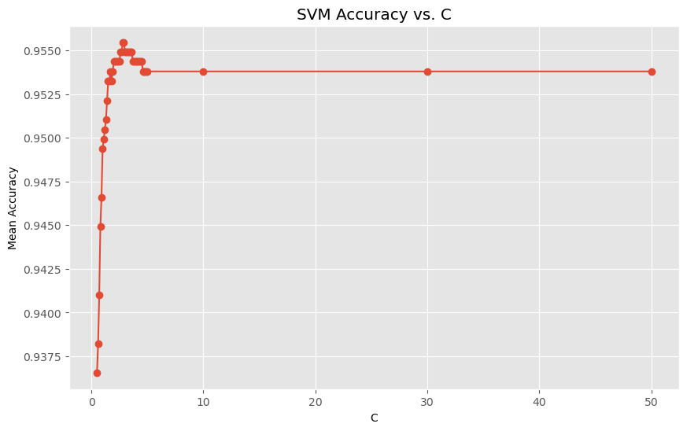
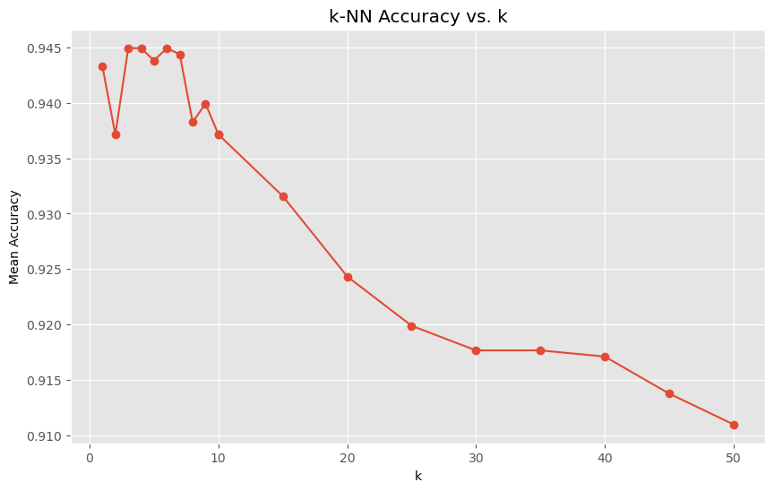

# SVM-vs-kNN-Classification

This Python project compares the accuracies of Support Vector Machine (SVM) and k-Nearest Neighbors (kNN) classifiers using the MNIST Handwritten Digits dataset. The project includes visualizations to illustrate the performance differences between these two methods.

## Prerequisites

Before running the project, make sure you have the following software installed:

- Python 3.x
- Jupyter Notebook
- Necessary Python libraries (Pandas, Numpy, scikit-learn, matplotlib)

If you don't have a Jupyter Kernel set up locally, follow the instructions on the [official Jupyter website](https://jupyter.org/install).

## Installation

1. **Clone the repository:**
   ```sh
   git clone https://github.com/reshmar00/SVM-vs-kNN-Classification.git
   cd SVM-vs-kNN-Classification

2. **Install the required libraries:**
   ```sh
   pip install pandas numpy scikit-learn matplotlib

## Usage

1. **Start Jupyter Notebook:**
   ```sh
   jupyter notebook

2. **Open the Jupyter Notebook file:**
&nbsp;Navigate to the cloned repository directory and open `SVM_vs_kNN_Classification.ipynb`.

3. **Run the notebook cells:**
&nbsp;Execute each cell in the notebook to load the dataset, train the classifiers, and generate the plots.

## Dataset

The MNIST dataset is a widely used dataset of handwritten digits, which is included in the `sklearn.datasets` module. It contains 70,000 images of digits, each 28x28 pixels in size.

## Libraries

The following libraries are used in this project:

- **Pandas:** For data manipulation and analysis
- **Numpy:** For numerical computations
- **scikit-learn:** For machine learning algorithms
- **matplotlib:** For plotting and visualization

## Data Preview

Here is a preview of the MNIST dataset (handwritten digits):



## Observations

#### SVM Classifier



#### kNN Classifier



## Conclusion

This project demonstrates the differences in accuracy and performance between SVM and kNN classifiers using the MNIST dataset. Observations and detailed analysis can be found in the Jupyter Notebook.

